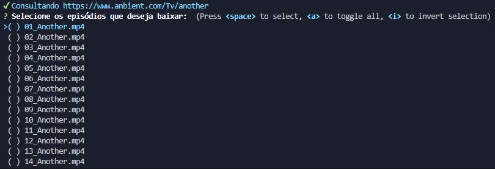

<a href='https://www.npmjs.com/package/anbient-dl'>
    
</a>
<a href='https://www.npmjs.com/package/anbient-dl'>
    
</a>

# anbient-dl

A função do `anbient-dl` é automatizar o *download* dos animes listados no site Anbient e hospedados no Zippyshare. O formato de saída dos arquivos é `.mp4`.

## *Features*

- *Download* de animes via CLI.

- Menu para selecionar os episódios que deseja baixar.

- Barra de progresso de download.

## Instalação

> Requer o [Node.js](https://nodejs.org/en/)

```
npm install -g anbient-dl
```

## Utilização

#### CLI

- `dl [...]`

#### Args
- `-v, --version` versão atual.
- `-i, --input` (necessário) Anbient url.
- `-o, --output` (necessário) diretório de saída. 
- `-h, --help` informações de ajuda.

#### Exemplo
```
dl -i https://www.anbient.com/Tv/another -o "C:\Users\User\Videos\Another"
```



## Aviso legal

O `anbient-dl` foi desenvolvido unicamente para facilitar o `download` de animes dos sites Anbient e Zippyshare. O usuário tem total responsabilidade de como irá utilizar o material baixado.