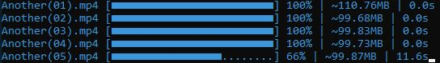

# anbient-dl

Download em `.mp4` dos animes do site Anbient.

## Requisitos

- [Node.js](https://nodejs.org/en/)

## Instalação
`npm install -g anbient-dl`

## CLI 
- `-v, --version` versão atual.
- `-i, --input` (necessário) Anbient url.
- `-o, --output` (necessário) diretório de saída. 
- `-h, --help` informações de ajuda.

#### Exemplo
`dl -i https://www.anbient.com/Tv/another -o C:\Users\User\Desktop\Another`

Obs: Utilize aspas em diretórios com espaços.

## Aviso legal

Caso você seja proprietário do Anbient ou Zippyshare e considera que o `anbient-dl` viola seus Termos de Serviço e Uso, escreva uma *[issue](https://github.com/ArturMiguel/anbient-dl/issues)* sobre a violação para que eu remova o projeto.
